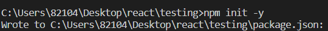

# 의존성 설치 및 세팅
## 명령어로 의존성을 설치합니다.
  ```bash
  $ npm init -y
  ```

  

<br /><br />

## 다음으로 `rollup`, `storybook`, `styled-component`, `sass`, `typescript`, `babel`을 설치합니다.
 > **주의점 DevDependance로 깔아야 함**

  ### 0. typescript 설치
  ```bash
  $ npm i -D @types/react @types/react-dom typescript styled-components @types/styled-components sass react react-dom
  ```
  <br/>

  `tsconfig.json`
  ```json
  {
    "compilerOptions": {
        "outDir": "build",
        "module": "esnext",
        "target": "es5",
        "lib": ["es6", "dom", "es2016", "es2017"],
        "sourceMap": true,
        "allowJs": false,
        "jsx": "react",
        "declaration": true,
        "moduleResolution": "node",
        "allowSyntheticDefaultImports": true,
        "resolveJsonModule": true,
        "esModuleInterop": true
    },
    "include": ["src", "images.d.ts", "declaration.d.ts"],
    "exclude": ["node_modules", "build"]
}
```

  `images.d.ts`
```typescript
declare module '*.svg'
declare module '*.png'
declare module '*.jpg'
declare module '*.jpeg'
declare module '*.gif'
declare module '*.bmp'
declare module '*.tiff'
```

  `declaration.d.ts`
```typescript
// declaration.d.ts
declare module '*.scss' {
    const content: { [className: string]: string };
    export default content;
}

// storybook은 mdx로 docs를 편하게 작성할 수 있습니다.
declare module '*.mdx';
```

<br/><br/>


### 1. react, react-dom, sass, styled-components 설치

```bash
$ npm i --save react react-dom
# or
$ yarn add --peer react react-dom sass styled-components
```
> peearDependancy에도 설치해야 함
> peerDependency란? 패키지를 사용하는 프로젝트에서 peerDependancy에 들어가 있는 것들 즉, react, react-dom을 가지고 있어야 한다는 뜻
> 
> yarn을 사용하지 않는 사람은 `dependencies`로 설치되는데 그냥 `peerDependencies`로 옮기면 된다.

<br />

`package.json`
```json
{
  // ...
  "peerDependencies": {
    "react": "^17.0.1",
    "react-dom": "^17.0.1",
  }
}
```

<br/><br/>  

### 2. storybook 설치 및 세팅

```bash
$ npm i -D sass-loader style-loader css-loader
```

```
$ npx -p @storybook/cli sb init --type react
```

이제 `npm run storybook`을 이용해서 스토리북을 실행해봅니다. 그러면 스토리북 페이지로 이동할 수 있습니다.

<br />

> .storybook 디렉토리를 열으시면 main.js 라는 파일이 다음과 같이 적혀있습니다.

`.storybook/main.js`
```javascript
module.exports = {
  "stories": [
    "../src/**/*.stories.mdx",
    "../src/**/*.stories.@(js|jsx|ts|tsx)"
  ],
  "addons": [
    "@storybook/addon-links",
    "@storybook/addon-essentials"
  ]
}
```

<br />

> 다음으로 storybook에서 플러그인 역할을 하는 addon을 설치 후 scss와 typescript, storybook-addon을 설정해주세요.

```bash
$ npm i -D @storybook/addon-actions @storybook/addon-essentials @storybook/addon-info @storybook/addon-links @storybook/addons @storybook/addon-docs @storybook/addon-knobs babel-preset-react-app
```

`.storybook/main.js`
```javascript
const path = require('path');

module.exports = {
  stories: ['../src/**/*.stories.@(ts|tsx|js|jsx|mdx)'],
  addons: [
    "@storybook/addon-actions",
    "@storybook/addon-essentials",
    "@storybook/addon-knobs",
    "@storybook/addon-links",
    {
        name: '@storybook/addon-docs',
        options: {
            configureJSX: true,
            babelOptions: {},
            sourceLoaderOptions: null,
        },
    },
    ],
    webpackFinal: async (config) => {
        config.module.rules.push({
            test: /\.scss$/,
            use: ['style-loader', 'css-loader', 'sass-loader'],
            include: path.resolve(__dirname, '../'),
        });

        config.module.rules.push({
            test: /\.(ts|tsx)$/,
            loader: require.resolve('babel-loader'),
            options: {
                presets: [['react-app', { flow: false, typescript: true }]],
            },
        });
        config.resolve.extensions.push('.ts', '.tsx');

        return config;
    },
};
```

<br/><br/>

> 위의 코드에서 `babel-loader`로 바벨을 사용하기 때문에 babel 리액트와 타입스크립트 세팅을 작성해줍니다.

`.babelrc`
```json
{
  "presets": ["@babel/preset-env", "@babel/preset-react", "@babel/preset-typescript"]
}
```

<br/><br/>

## 다음으로
0. 스토리북 세팅하기
1. **첫번째 컴포넌트** [이동하기](../1_first_component/README.md)
2. 스토리북으로 docs작성하기
3. 스토리북 배포하기
4. NPM에 배포하기