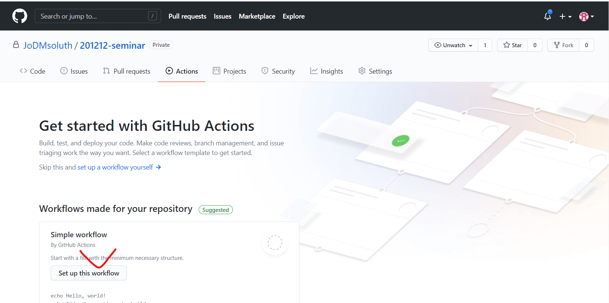
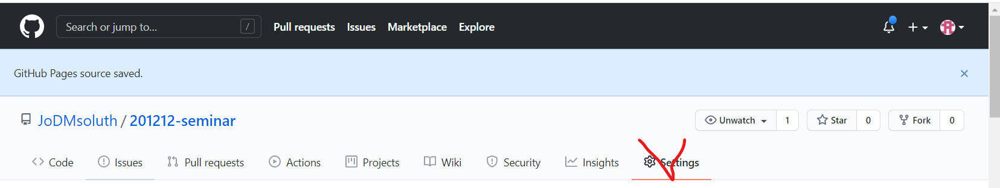

# 스토리북 배포하기

## 첫 배포하기

1. 배포 패키지 설치
`npm i -D @storybook/storybook-deployer`

2. `package.json` 수정
```json
{
  // ...
  "scripts": {
    "test": "echo \"Error: no test specified\" && exit 1",
    "storybook": "start-storybook -p 6006",
    "build-storybook": "build-storybook",
    "deploy-storybook": "storybook-to-ghpages",
  },
  // ...
  "storybook-deployer": {
     "gitUsername": "github name", // 자신의 깃허브 이름
     "gitEmail": "github email", // 자신의 깃허브 이메일
     "commitMessage": "Deploy Storybook"
  },
}
```
3. 깃허브 repository push
> 배포할 내용일 github repository에 올립니다.
   
4. 스토리북 배포하기
   `npm run deploy-storybook`

- 배포한 url로 들어가면 다음과 같이 나옵니다.


> repository를 public으로 바꾸고 다시 배포해보세요.
> github > repository > settins > github pages에 있는 url로 들어가보세요


<br /><br />

- 아주 멋지게 배포된 사이트를 확인해 볼 수 있습니다.


<br /><br />

> 이제 위의 활동을 깃허브 master branch에 푸시할 때마다 배포를 자동화 해봅시다.

<br /><br />

## git actions을 이용한 ci

1. 먼저 Git Actions 파일을 만들어줍니다.

- github의 해당 repository에 들어가면 actions 탭이 있습니다.
  


- 그럼 다음과 같이 초기 파일이 만들어지는데 이를 다음과 같이 수정해 줍니다.
```yaml
# This workflow will run tests using node and then publish a package to GitHub Packages when a release is created
# For more information see: https://help.github.com/actions/language-and-framework-guides/publishing-nodejs-packages

name: Node.js Package

on:
    push:
        branches: [master]

jobs:
    publish-gpr:
        runs-on: ubuntu-latest
        steps:
            - uses: actions/checkout@v2
            - name: Set up Python
              uses: actions/setup-python@v1
              with:
                  python-version: '3.8'
            - uses: actions/setup-node@v1
              with:
                  node-version: 12
                  registry-url: https://npm.pkg.github.com/

            - run: npm install
            - name: Deploy Storybook
              run: npm run deploy-storybook -- --ci
              env:
                  GH_TOKEN: JoDMsoluth:${{ secrets.GH_TOKEN }}
```

- 여기서 중요한 부분은 마지막 부분인데 
```yml
 name: Deploy Storybook
    run: npm run deploy-storybook -- --ci
    env:
        GH_TOKEN: JoDMsoluth:${{ secrets.GH_TOKEN }}
```
git actions 에서는 환경변수를 추가할 수 있습니다. 환경변수로 github_access 토큰을 넣어주어야 합니다. 아무래도 아무나 내 깃허브에 푸시하면 안되니 당연히 엑세스 토큰이 필요하겠죠??

2. git actions 환경변수 추가하기

- [github token 발급받기](https://github.com/settings/tokens)
- Generate new token 클릭

- 발급받은 토큰을 repository settings > secrets 탭에 들어가서 추가합니다. 토큰명은 GH_TOKEN으로 해주세요


3. 이제 코드를 변경하고 다시 master branch에 푸시합니다.