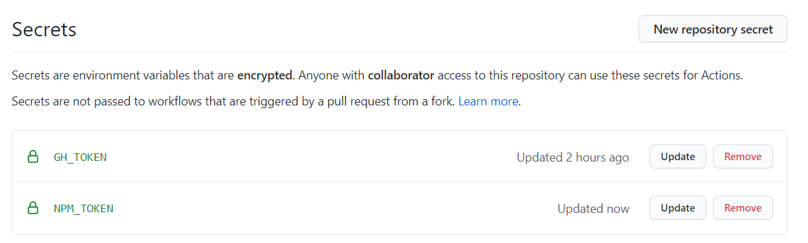
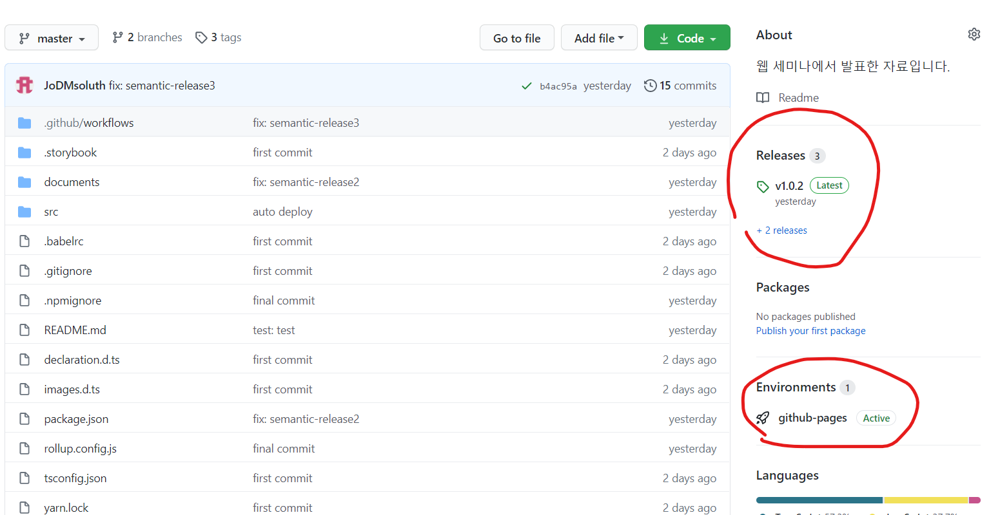

# npm 배포하기

1. npm에 배포하기 앞서 설정을 해주어야 합니다.

<br />

`package.json`
```json
{
  "name": "npm에 배포할 파일명(중복불가)",
  "version": "v0.
  0.1", // npm에 배포할 버전명(중복불가)
  "main": "lib/index.js",
  "module": "lib/index.esm.js", // 사용자가 패키지 다운받아 사용할 때 접근하는 entry파일
  "types": "lib/index.d.ts",
  "files": [
      "lib"
  ],
  // npm에서 사용할 keywords와 description도 수정해주자 (선택)
  // ...
  "license": "MIT",
  // ...
  "scripts": {
    "build": "rollup -c",
    // ...
  }
  // ...
}
```
   
<br/><br/>

2. rollup 설정 파일 만들기
   
<br /> 

코드를 그대로 올릴 수는 없으니 번들링을 해주기 위해 rollup을 설정합니다. rollup은 commonjs방식 이나 esm 방식으로 만든 외부 패키지를 별도의 설정없이 번들링 해주는 장점이 있어 쉽게 사용할 수 있습니다.

<br />
   
`rollup.config.js`
```javascript
import peerDepsExternal from 'rollup-plugin-peer-deps-external';
import { nodeResolve } from '@rollup/plugin-node-resolve';
import typescript from 'rollup-plugin-typescript2';
import path from 'path';
import sass from 'rollup-plugin-sass';
import commonjs from '@rollup/plugin-commonjs';

import packageJson from './package.json';

export default {
    input: 'src/index.tsx',
    output: [
        {
            dir:"lib",
            format: 'cjs',
            sourcemapPathTransform: (relativePath) => {
              return path.relative('src', relativePath);
            },
            sourcemap: true,
        },
    ],
    plugins: [
        peerDepsExternal(),
        nodeResolve({
            browser: true,
        }),

        typescript({ objectHashIgnoreUnknownHack: true }),
        commonjs({
          include: /node_modules/,
        }),
        sass({
            insert: true,
        })
    ],
};
```

<br/><br/>

3. `npm run build`

4. .npmignore 파일 추가
   
```text
# Logs
logs
*.log
npm-debug.log*
yarn-debug.log*
yarn-error.log*

# Runtime data
pids
*.pid
*.seed
*.pid.lock

# Directory for instrumented libs generated by jscoverage/JSCover
lib-cov

# Coverage directory used by tools like istanbul
coverage

# nyc test coverage
.nyc_output

# Grunt intermediate storage (http://gruntjs.com/creating-plugins#storing-task-files)
.grunt

# Bower dependency directory (https://bower.io/)
bower_components

# node-waf configuration
.lock-wscript

# Compiled binary addons (http://nodejs.org/api/addons.html)
build/Release

# Dependency directories
node_modules/
jspm_packages/

# Typescript v1 declaration files
typings/

# Optional npm cache directory
.npm

# Optional eslint cache
.eslintcache

# Optional REPL history
.node_repl_history

# Output of 'npm pack'
*.tgz

# Yarn Integrity file
.yarn-integrity

# dotenv environment variables file
.env

# Only apps should have lockfiles
npm-shrinkwrap.json
package-lock.json
yarn.lock
```
   
5. npm 배포하기

```bash
$ npm login
$ npm whoami
$ npm publish --access=public
```

<br />
<br />

## npm 배포 자동화
이제 semantic-release 패키지를 이용하여 위의 활동들을 자동화 합니다.
> semantic-release는 npm 배포를 자동화 하는 패키지입니다.

<br />

- [semantic-release](https://github.com/semantic-release/semantic-release)
- [semantic-release youtube tutorial](https://www.youtube.com/watch?v=iKeCt0F1XLg)

<br />

1. commitlint 추가
```bash
$ npm i -D @commitlint/cli @commitlint/config-conventional husky
```

`package.json`
```json
{
  //...
  "commitlint": {
    "extends": [
      "@commitlint/config-conventional"
    ]
  },
  "husky": {
      "hooks": {
          "commit-msg": "commitlint -E HUSKY_GIT_PARAMS"
      }
  }
}
```

> commitlint를 추가하는 이유는 semantic-release가 `fix:`와 `feat:` 으로 시작하는 커밋메시지에 반응하여 기존 코드와의 변화를 감지하기 때문입니다.

<br />

2. npm access token 발급받기
   [토큰 발급](https://www.npmjs.com/settings/nodelab/tokens) > Generate New Token > Publish 체크 > 발급받은 토큰을 git actions secrects 변수에 추가(환경변수 명은 NPM_TOKEN)
   
   > 최종적으로 두개의 secret key를 발급 받았습니다.

   

3. package.json 수정
배포할때마다 버전명이 달라져야 하므로 아래와 같이 수정

```json
{
  "version": "0.0.0-semantically-released",
}
```

4. git actions yml 수정

```yml
name: Node.js Package

on:
    push:
        branches: [master]

jobs:
    publish-gpr:
        runs-on: ubuntu-latest
        steps:
            - uses: actions/checkout@v2
            - uses: actions/setup-node@v1
              with:
                  node-version: 12
                  registry-url: https://npm.pkg.github.com/

            - run: npm install
            - name: Deploy Storybook
              run: npm run deploy-storybook -- --ci
              env:
                  GH_TOKEN: 여러분의 계정명:${{ secrets.GH_TOKEN }}
            - run: npm run build
            - name: Release
              run: npx semantic-release
              env:
                  GITHUB_TOKEN: ${{ secrets.GH_TOKEN }}
                  NPM_TOKEN: ${{ secrets.NPM_TOKEN }}
```

<br /><br />

5. git actions yml 수정
   
<br />
  
이제 깃허브에 push하면 자동으로 npm과 storybook에 배포가 완료됩니다.

<br />



<br />

## 수고하셨습니다.
이제 자신만의 디자인 시스템을 만들 수 있겠군요 <br />
여러분들은 더 나아가 `jest`, `lintstage`, `eslint`, `prettier`를 husky에 추가하여 커밋을 할때마다 코드를 테스트할 수 있게 만들어 보는 것도 좋을 것 같습니다. 😎<br />
또한, 자신만의 storybook 사용법을 만들어 가시는 것도 좋을 것 같아요. <br />
감사합니다. 😁😁

<br />
<br />

추가로 궁금한 점이 있으시면 언제든지 연락주세요 ... by **Jod** 🔥 <br />
email: jodmsoluth@gmail.com <br />

<br />

## 마무리
0. 스토리북 세팅하기
1. 첫번째 컴포넌트 
2. 스토리북으로 docs작성하기
3. 스토리북 배포하기
4. **NPM에 배포하기**